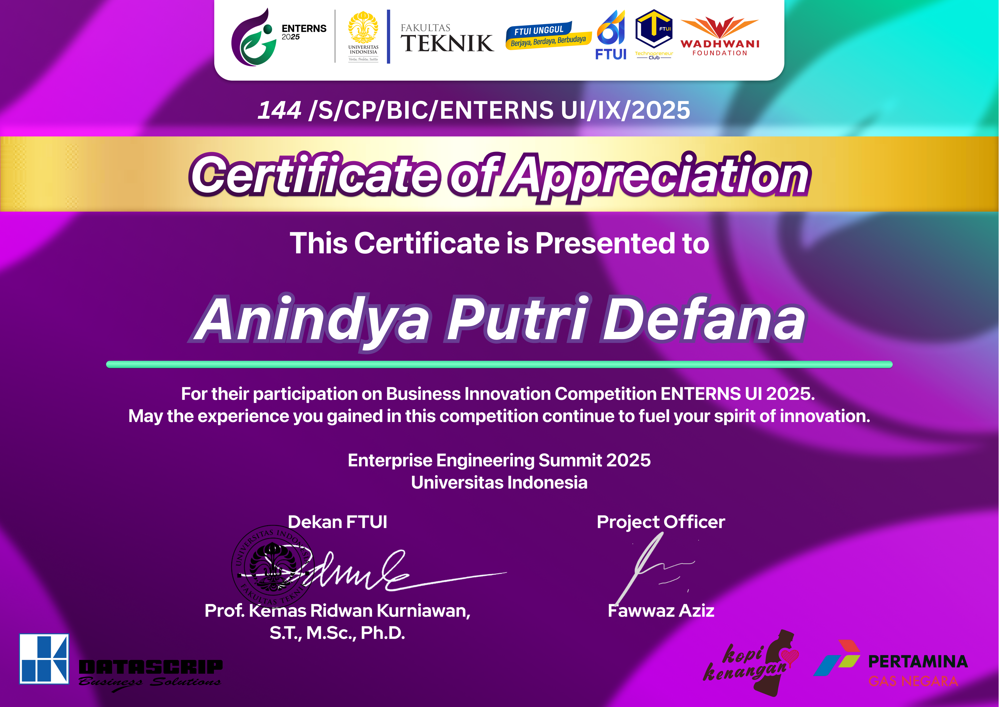

# 🏆 Certificate & Achievements

This repository contains selected certifications and achievements that reflect my academic development, leadership experience, innovation activities, and English proficiency.

---

## 🥇 Top 10 Finalist – Business Innovation Competition (ENTERNS UI 2025)

Selected as one of the **Top 10 Finalist Teams** in the Business Innovation Competition organized by the Enterprise Engineering Summit (ENTERNS) Universitas Indonesia.

### Certificate

---

## 📜 Inclusive Leadership Skills (ILS)

Successfully completed the **Inclusive Leadership Skills (ILS)** program, focusing on leadership, teamwork, communication, and inclusive decision-making.

### Certificate
📄 [View Certificate](inclusive_leadership_skills.pdf)

---

## 🇬🇧 English Proficiency Test (EPT) – LBI Universitas Indonesia

Achieved an **EPT Score of 507**, demonstrating English proficiency in listening, structure, written expression, vocabulary, and reading comprehension.

### Certificate
📄 [View Certificate](LBI_test.pdf)
